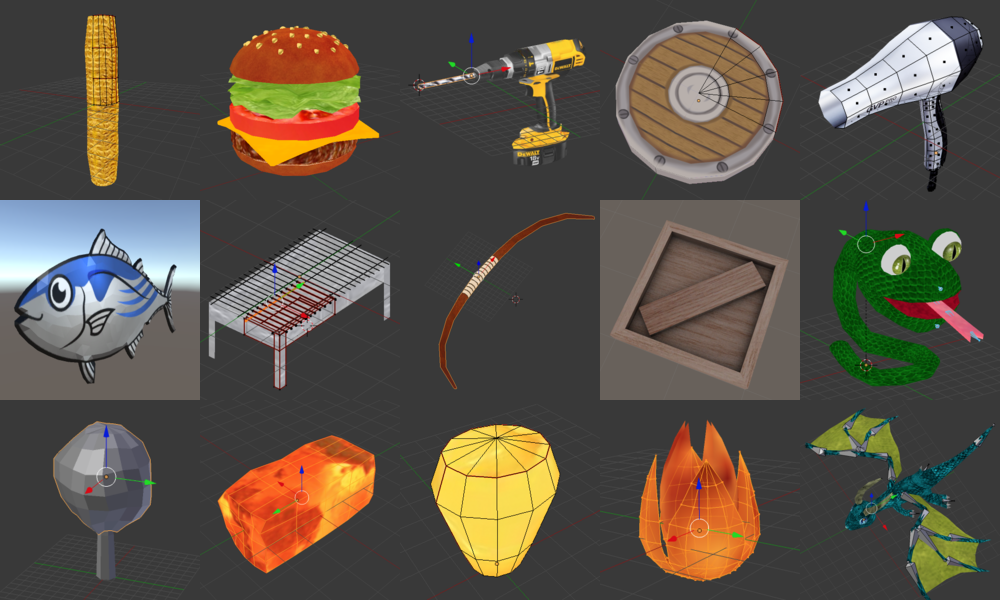

# Blender 3D Models

# Images

# Rule

* save as .blend

# Texture

* psd & png

# Tips

* EditからPで別オブジェクトに分離

# 手順
* レイヤーに分けて各部品を作る
* テクスチャを1枚作る
* 各部品をUV展開して1枚のテクスチャにおさめる
* Photoshop(PS)で開く
* 各部品のUV Layoutを画像で出力し、それもPSへ
* 塗る		
* PNG出力時にUV Layoutは非表示にする
* psdで保存する
* BlenderでTexture表示にして確認