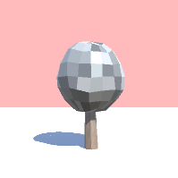
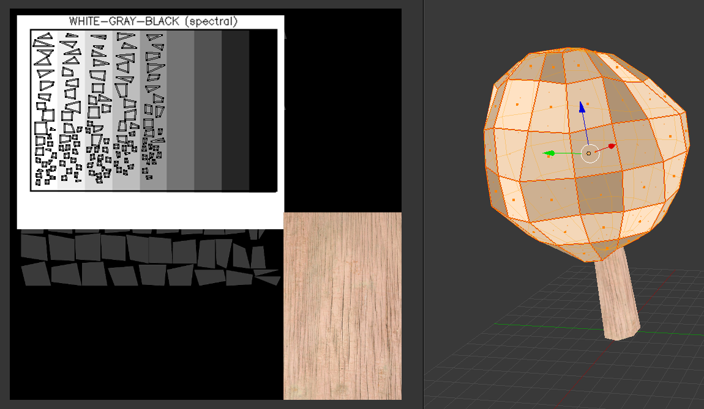

# Low Poly Tree

* 252 tris

# Any Color

* Base color is gray
* At Unity, You can change leaf color by changing Material color

# How to Make

* About Leaf Sphere, Select All Edge and Mark Seam
* UV Unwrap
* UV Align by hand like this (see below)

