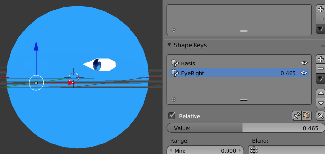

# Blendshape for eye test

* 1 material (face and eyes)
* ref [my blog](http://peroon.hatenablog.com/entry/2015/10/01/121056)
* blendshape for eye direction: success

## Conclusion

* 1 material character is possible
* he can blink and change eye direction