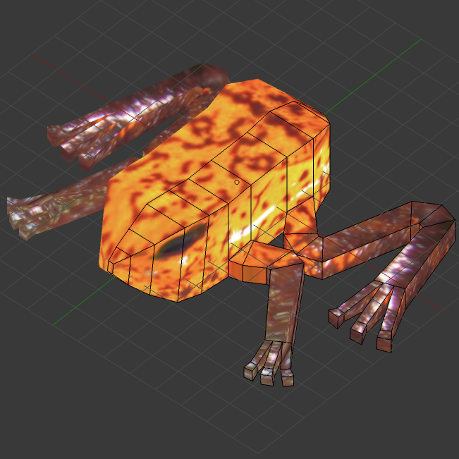

# frog

* [creative commons image](https://www.flickr.com/photos/leaflanguages/7109557433)

## Modifier Mirror

* oragne point is "origin"
* to move, Shift+Ctrl+Alt+C
* it is mirror's origin

## UV

* project from view