# Example

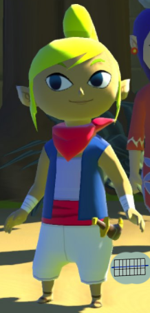

# Progress

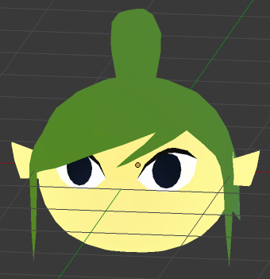
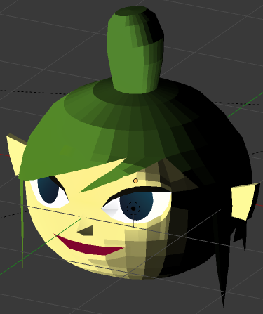

# Output

# Problem

* 左を向きながら目を閉じるとまぶたを目玉が貫通する・・・
* 目を閉じながら（顔側Meshをいじりながら）目玉Meshも動かすことはできない
* 同一メッシュにする？
* 一般的に言うと別MeshのBlendshapeが重なる部分で問題がおこる			

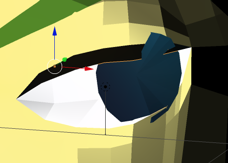

# How to make next time

* 顔に目の形でMeshはってEでくぼませる
* 目玉も同一Mesh管理するために、くぼませた後で目玉の形でMeshはる

# Hair bone

* Automatic Weight : Select mesh, bone, Ctrl+P

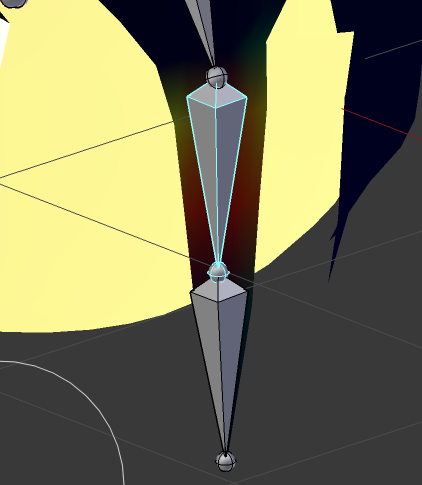

# Body

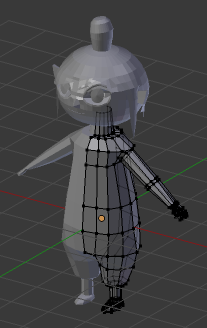
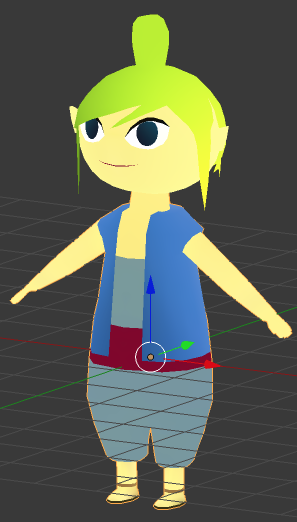

# Ear

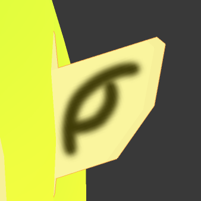

* Basisの耳を丸くして丸みをもたせたらBlendshape後の方に反映されず、各Blendshapeにも同様の変形をする必要があった

# Hand

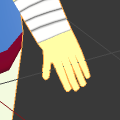

* for bone

# Blendeshape import to Unity Problem

* Mirror and Shapekey -> blendshape is not imported to Unity
* そうだった・・・
* Shapekeyを付ける前にMirrorをApplyしておく必要がある

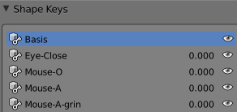

# Remake shape key

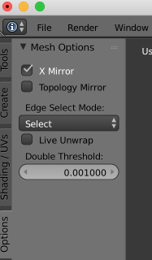

* Mirrorを切ってもX Mirrorを使えばMesh調整を省力化できる

# Unity
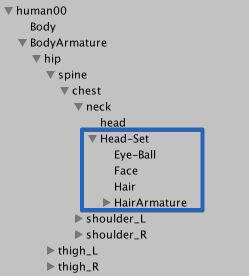

* Humanoid
* 頭を体の首ボーンの子にする

# Run Animation

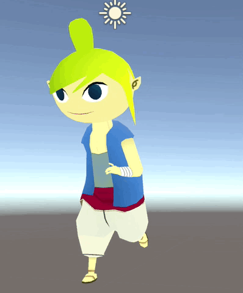

* 赤い腹巻きのWeight調整が必要

# Nice Run!

* Weightと首のテクスチャ調整

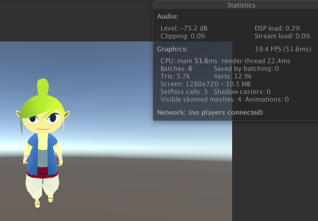

# Arm

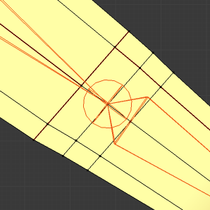
* 腕の変形時に角っぽくなるのでctrl+Rで分割を増やした
* ねじれの対応も必要だな・・・

# 邪眼
* Fire-prepare pose

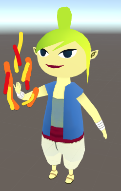
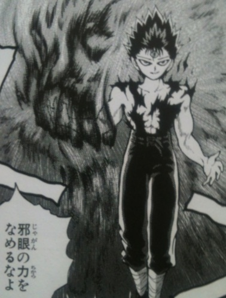

# Head parent is neck bone

* そうしないとAnimation作るときに顔の向きが付いてこない
* TODO 髪揺れ用のボーンはどうする？

# Shot

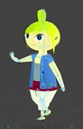

