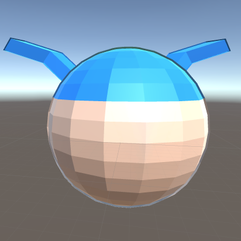

# Contour drawing using using inverse polygon

## Output

* contour color of blue hair is blue
* contour color of face is skin color

## Goal

* thickness controllable edge
* vertex color contour

## How to

### 1. Blender

* prepare a model
* dupulicate it using Shift+D
* in edit mode, press Alt+S and scale dupulicated model toward normal vector
* flip normal vector of the dupulicated model
* set each material to two models, and the matterial attached to the dupulicated model color to red
* in material view, confirm the thickness of contour

### 2. Unity

* import texture and model to unity, and put it into a scene
* set two material to each mesh
* each material has same diffuse texture
* change edge material color darker
* finish!

This method can have variable color contour in accordance with vertex color. You can adjust each contour thickness by adjusting edge model.