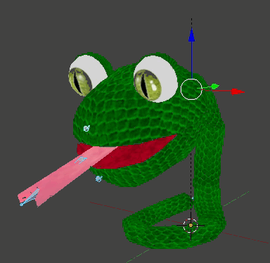
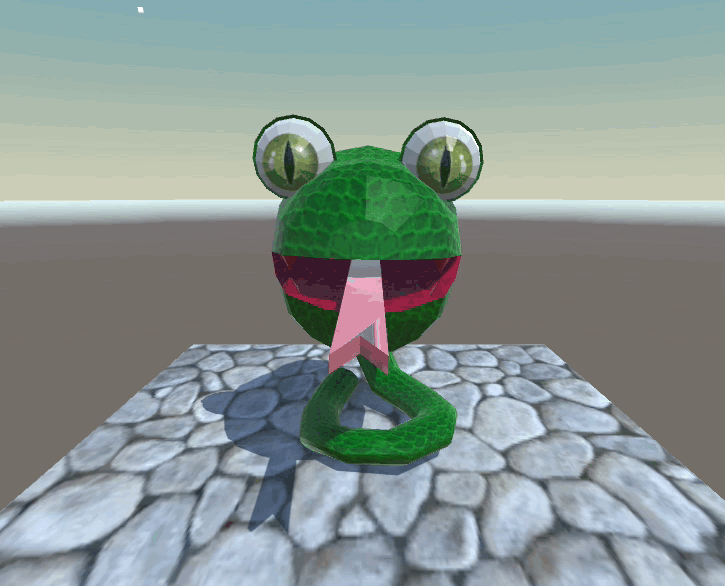
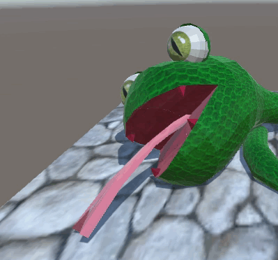
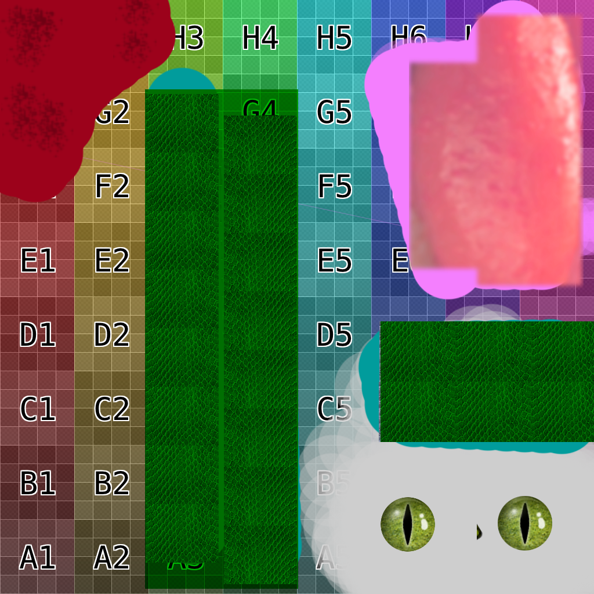

# Snake

# Bone Animation

* I made give up animation
* I think it is important for showing that the snake is down apparently and giving accomplishment feeling for player.

# Blend Shape

* Snake tongue length is controllable by Blend Shape.
* In Unity, the value is at Skinned Mesh Renderer at Inspector.

