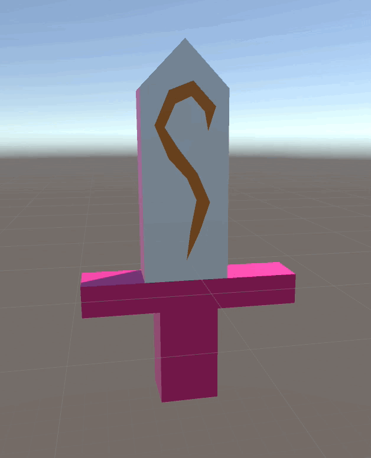
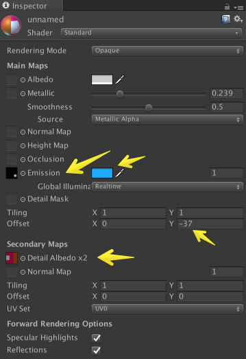
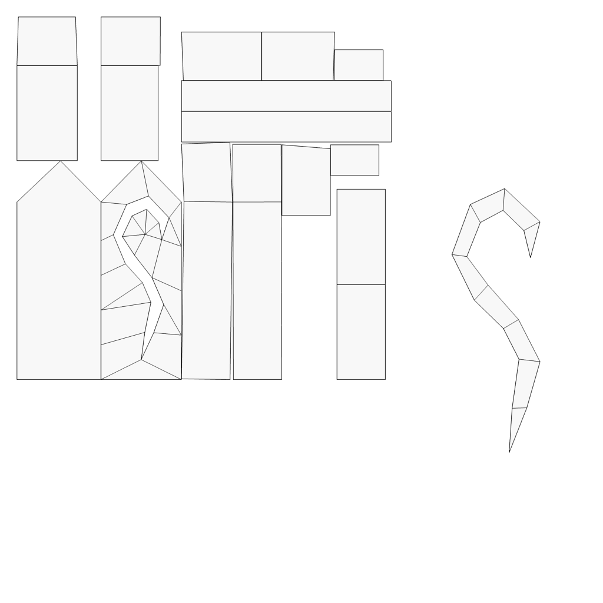
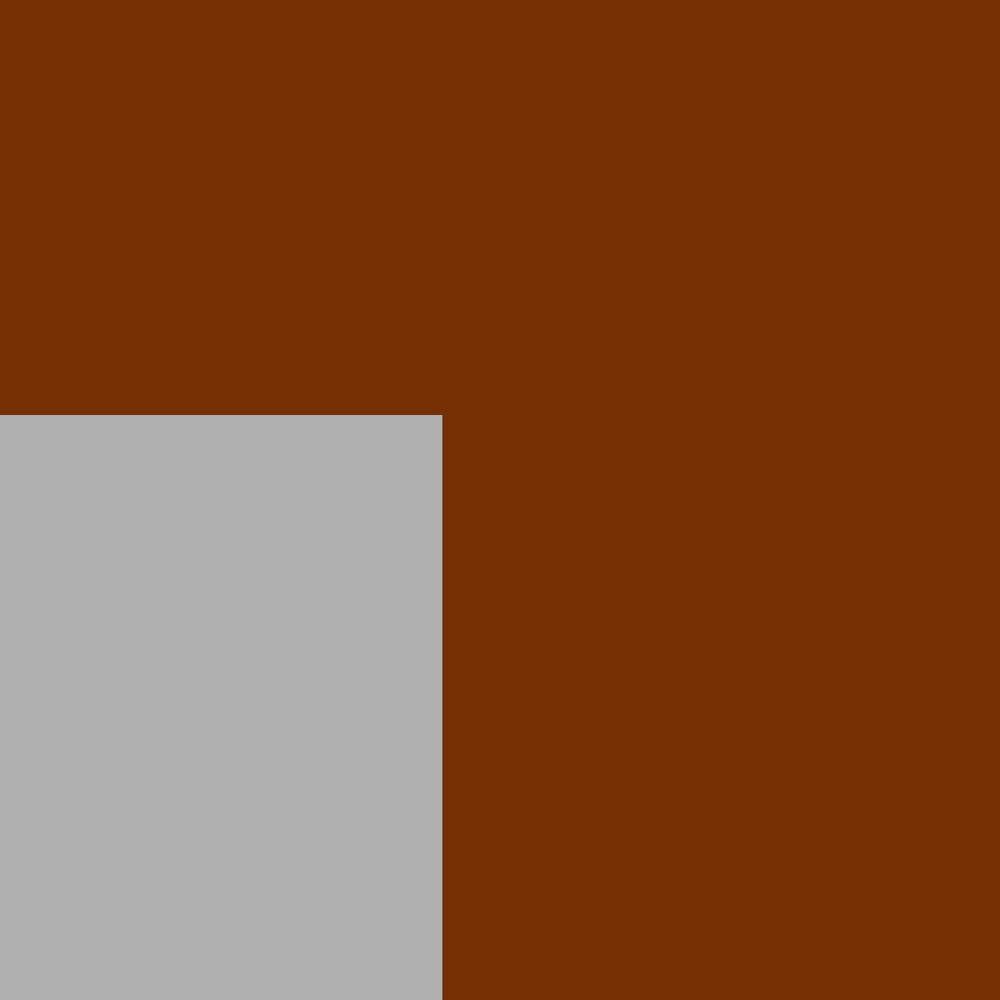

# Sword

* emission texture experiment in Unity

## Output

## Inspector in Unity

* on emission, grayscale image is enough, because the color is adjustable and image size can be reduced

## UV Texture

## Diffuse Texture

## Light Texture 

* use texture offset for emission movement

