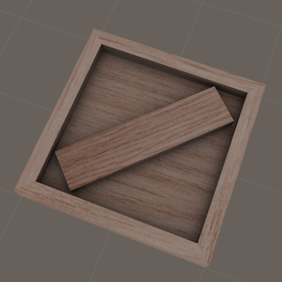

# Timber

http://putiya.com/html/fish/fish_creature01_02.html

# Ambient Occlusion Bake

* Modeling
* UV Unwrapping
* Arrange UV Coordinates (overlap is prohibitted for Bake)
* Ambient Occlusion Bake
* By Photoshop, make one texture (diffuse.png + ao.png)
* refs http://royaaaa.hatenablog.com/entry/2015/02/18/181602

# Unity Output

* Unlit Shader
* It is not affected shader lighting, but it seems shaded by baked texture.
* 
