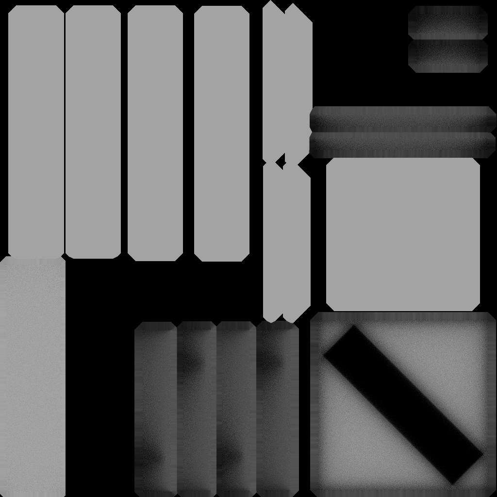

# Timber

# Ambient Occlusion Bake

* Modeling
* UV Unwrapping
* Arrange UV Coordinates (overlap is prohibitted for Bake)
* Ambient Occlusion Bake
* By Photoshop, make one texture (diffuse.png + ao.png)
* refs http://royaaaa.hatenablog.com/entry/2015/02/18/181602

# Unity Output

* Unlit Shader
* This shader is not affected from lighting, but it seems shaded by baked texture.

# Baked Texture

* 
