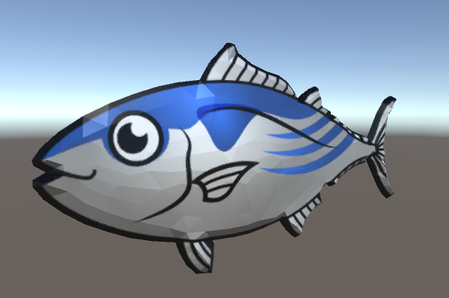

# Tuna

http://putiya.com/html/fish/fish_creature01_02.html

# Illust to Model

* Set a illust to Background Image
* Put vertex around edge
* fill triangles inner
* Mirror
* Make the model round by Proportional Editing
* (UV)Project From View

# output

