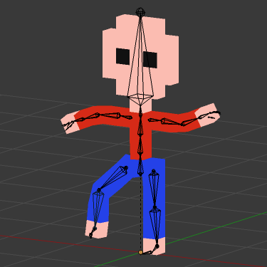
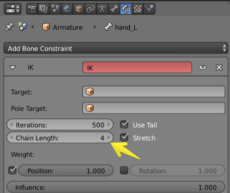
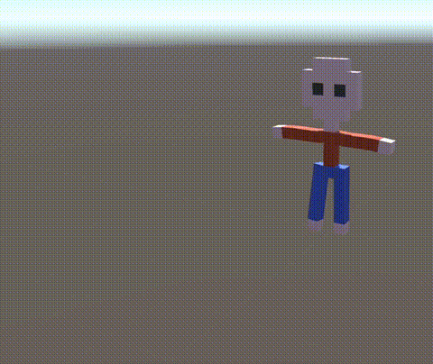

### Qubicle voxel modeling

* Qubicle voxel modeling
* obj export

### To edit, Blender

* import it into blender
* append human rig
* automatic weight (ctrl+P)
* check in pose mode

### Info

* 340 tris
* 30 minutes

### IK

* In Pose Mode,

* Set IK to wrists
* Make animation

### Unity

* Import to Unity
* It works!

